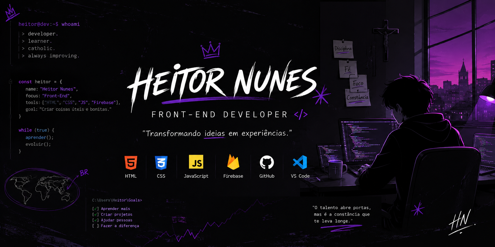

  

<h1 align="center">👋 Olá, eu sou o Heitor!</h1>

<h3 align="center">💻 Desenvolvedor Front-End | Aprendendo todos os dias 🚀</h3>

  

---

# 🚀 Sobre mim

💜 Sempre curti a área da tecnologia

🌎 Brasil

📚 Estudando Front-End

⚡ Criando projetos para aprender cada vez mais.

---

## 💻 Tecnologias

  
  
  
  
  
  

---

# 📊 Estatísticas

---

# 🔥 Sequência de Commits

---

# 🚀 Projetos

⭐ Painel Staff

⭐ Sistema de Verificação

⭐ Sites Responsivos

⭐ Ferramentas para Comunidades

## 🚀 Projetos Recentes
- [🍅 Pomodoro Focus Timer](https://hndeev.github.io/pomodoro-timer/) - Timer de produtividade com SVG animado
- [🔐 Gerador de Senhas](https://hndeev.github.io/password-generator/) - Ferramenta client-side segura

---

## 📊 Minhas Estatísticas

  
  

---

## 🐍 Contribuições

  

---

# 🌐 Contato

---

✨ Obrigado por visitar meu perfil! ✨

